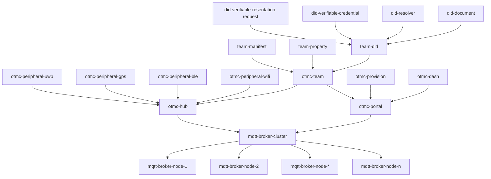
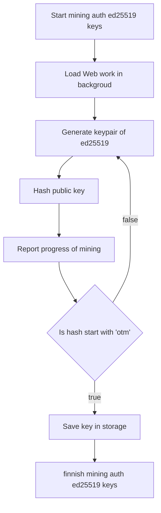
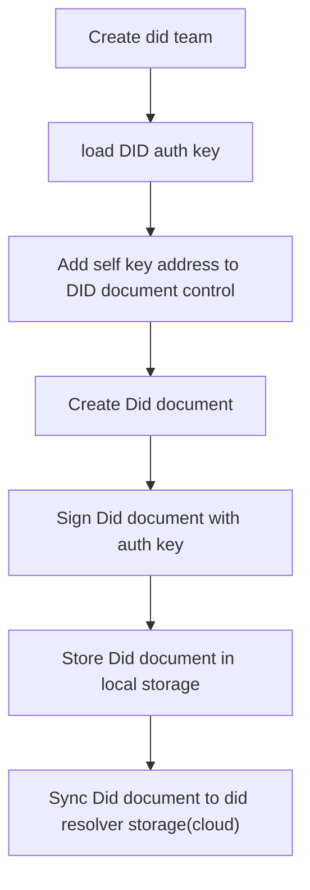
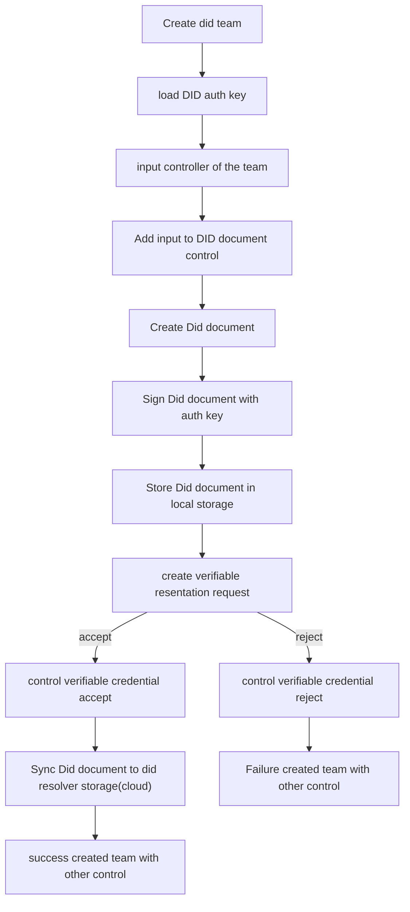
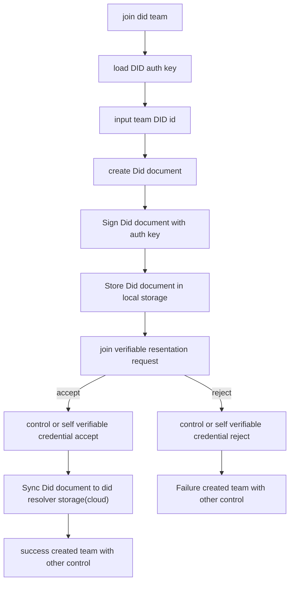

# otmc
open transparent mqtt cluster

## otmc structure:

## otmc flowchat.
### otmc mine auth key pair for did team.

### otmc create self-control did team.

### otmc create other-control did team.

### otmc join exist did team.

