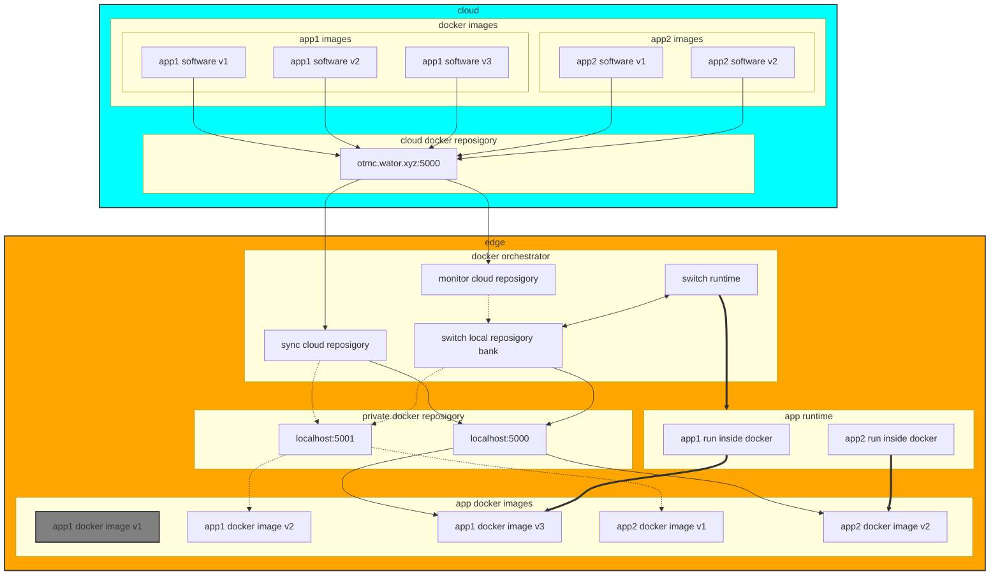

Use docker repositories mechanism update applications.

```mermaid
graph TD
    subgraph edge [edge]
        style edge fill:Orange,stroke:#333,stroke-width:2px
        subgraph repos_edge [private docker reposigory]
            edge_repo_b1["localhost:5000"]
            edge_repo_b2["localhost:5001"]
        end
        subgraph app_rt_edge [app runtime]
            edge_docker_rt_app1["app1 run inside docker"]
            edge_docker_rt_app2["app2 run inside docker"]
        end
        subgraph app_img_edge [app docker images]
            style edge_docker_img_app1_v1 fill:gray,stroke:#333,stroke-width:2px
            edge_docker_img_app1_v1["app1 docker image v1"]
            edge_docker_img_app1_v2["app1 docker image v2"]
            edge_docker_img_app1_v3["app1 docker image v3"]
            edge_docker_img_app2_v1["app2  docker image v1"]
            edge_docker_img_app2_v2["app2  docker image v2"]
        end
        subgraph orch [docker orchestrator]
            edge_repo_local_monitor["monitor cloud reposigory"]
            edge_repo_local_switch["switch local reposigory bank"]
            edge_repo_cloud_sync["sync cloud reposigory"]
            edge_runtime_switch["switch runtime"]
        end
    end
    subgraph cloud [cloud]
        style cloud fill:Cyan,stroke:#333,stroke-width:2px
        subgraph repos_cloud [cloud docker reposigory]
            cloud_repo["otmc.wator.xyz:5000"]
        end
        subgraph image_cloud [docker images]
            direction LR
            subgraph image_cloud_app1 [app1 images]
                direction LR
                cloud_sw_app1_v1["app1 software v1"]
                cloud_sw_app1_v2["app1 software v2"]
                cloud_sw_app1_v3["app1 software v3"]
            end
            subgraph image_cloud_app2 [app2 images]
                direction LR
                cloud_sw_app2_v1["app2 software v1"]
                cloud_sw_app2_v2["app2 software v2"]
            end
        end
        cloud_sw_app1_v1 --> cloud_repo
        cloud_sw_app1_v2 --> cloud_repo
        cloud_sw_app1_v3 --> cloud_repo
        cloud_sw_app2_v1 --> cloud_repo
        cloud_sw_app2_v2 --> cloud_repo
    end
    cloud_repo --> edge_repo_cloud_sync
    cloud_repo --> edge_repo_local_monitor

    edge_repo_local_monitor -.-> edge_repo_local_switch 

    edge_repo_cloud_sync --> edge_repo_b1
    edge_repo_local_switch -->edge_repo_b1 
    edge_repo_b1 --> edge_docker_img_app1_v3 
    edge_repo_b1 --> edge_docker_img_app2_v2 

    edge_repo_cloud_sync -.-> edge_repo_b2
    edge_repo_local_switch -.-> edge_repo_b2
    edge_repo_b2 -.-> edge_docker_img_app1_v2 
    edge_repo_b2 -.-> edge_docker_img_app2_v1

    edge_runtime_switch <--> edge_repo_local_switch

    edge_runtime_switch ==> app_rt_edge
    edge_docker_rt_app1 ==> edge_docker_img_app1_v3 
    edge_docker_rt_app2 ==> edge_docker_img_app2_v2 

```

