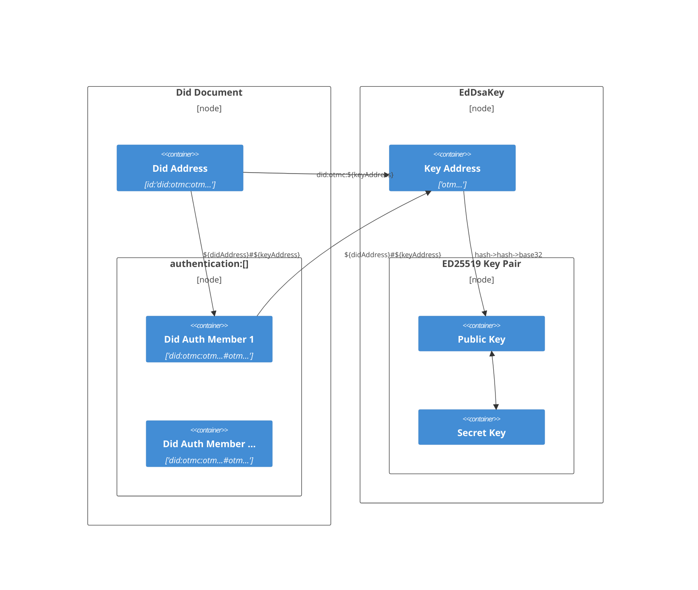
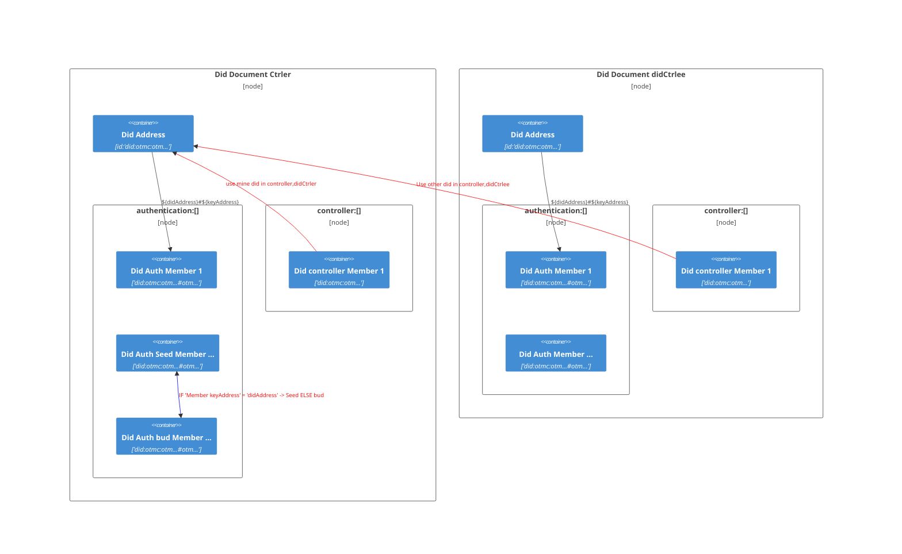

# otmc and did document
open transparent mqtt cluster

## DidDocument and EdAuth EdDsaKey:

```mermaid
C4Deployment
    Deployment_Node(did, "Did Document") {
        Container(didAddress, "Did Address","id:'did:otmc:otm...'")
        Deployment_Node(authhMembers, "authentication:[]") {
            Container(authMember, "Did Auth Member 1","'did:otmc:otm...#otm...'")
            Container(authMember2, "Did Auth Member ...","'did:otmc:otm...#otm...'")
        }
        Rel(didAddress, authMember,  "${didAddress}#${keyAddress}", "")
    }

    Deployment_Node(EdDsaKey, "EdDsaKey") {
        Container(keyAddress, "Key Address","'otm...'")
        Deployment_Node(ED25519Key, "ED25519 Key Pair") {
            Container(publicKey, "Public Key",)
            Container(secretKey, "Secret Key",)
        }
    }
    Rel(keyAddress, publicKey, "hash->hash->base32", "")
    BiRel(secretKey, publicKey, "", "")


    Rel(didAddress, keyAddress, "did:otmc:${keyAddress}", "")

    Rel(authMember, keyAddress, "${didAddress}#${keyAddress}", "")

    UpdateLayoutConfig($c4ShapeInRow="1", $c4BoundaryInRow="4")

```

## DidDocument ctrler, ctrlee, seed, bud:

```mermaid
C4Deployment
    Deployment_Node(didCtrler, "Did Document Ctrler") {
        Container(didAddress, "Did Address","id:'did:otmc:otm...'")
        Deployment_Node(authhMembers, "authentication:[]") {
            Container(authMember, "Did Auth Member 1","'did:otmc:otm...#otm...'")
            Container(authMemberSeed, "Did Auth Seed Member ...","'did:otmc:otm...#otm...'")
            Container(authMemberbud, "Did Auth bud Member ...","'did:otmc:otm...#otm...'")
        }
        Rel(didAddress, authMember,  "${didAddress}#${keyAddress}", "")
        BiRel(authMemberSeed, authMemberbud,  "IF 'Member keyAddress' = 'didAddress' -> Seed  ELSE bud", "")
        UpdateRelStyle(authMemberSeed, authMemberbud, "red", "blue")
        Deployment_Node(controllers, "controller:[]") {
            Container(controller, "Did controller Member 1","'did:otmc:otm...'")
        }
        Rel(controller, didAddress,  "use mine did in controller,didCtrler", "")
        UpdateRelStyle(controller, didAddress, "red", "red","-40","-40")
    }

    Deployment_Node(diddidCtrlee, "Did Document didCtrlee") {
        Container(didAddressEE, "Did Address","id:'did:otmc:otm...'")
        Deployment_Node(authhMembersLE, "authentication:[]") {
            Container(authMemberLE, "Did Auth Member 1","'did:otmc:otm...#otm...'")
            Container(authMemberLE2, "Did Auth Member ...","'did:otmc:otm...#otm...'")
        }
        Rel(didAddressEE, authMemberLE,  "${didAddress}#${keyAddress}", "")
        Deployment_Node(controllersLE, "controller:[]") {
            Container(controllerLE, "Did controller Member 1","'did:otmc:otm...'")
        }
        Rel(controllerLE, didAddress,  "Use other did in controller,didCtrlee ", "")
        UpdateRelStyle(controllerLE, didAddress, "red", "red","-40","-40")

    }

    UpdateLayoutConfig($c4ShapeInRow="1", $c4BoundaryInRow="4")

```

## DidDocument Proof (in progress):

```mermaid
C4Deployment
    Deployment_Node(didProof, "Did Document Proofed") {
        Container(didAddress, "Did Address","id:'did:otmc:otm...'")
        Deployment_Node(authhMembers, "authentication:[]") {
            Container(authMember, "Did Auth Member 1","'did:otmc:otm...#otm...'")
            Container(authMemberSeed, "Did Auth Seed Member ...","'did:otmc:otm...#otm...'")
            Container(authMemberBud, "Did Auth Bud Member ...","'did:otmc:otm...#otm...'")
        }
        Rel(didAddress, authMember,  "${didAddress}#${keyAddress}", "")
        BiRel(authMemberSeed, authMemberBud,  "IF 'Member keyAddress' = 'didAddress' -> Seed  ELSE Bud", "")
        UpdateRelStyle(authMemberSeed, authMemberBud, "red", "blue")
        Deployment_Node(controllers, "controller:[]") {
            Container(controller, "Did controller Member 1","'did:otmc:otm...'")
        }
        Rel(controller, didAddress,  "use mine did in controller,root", "")
        UpdateRelStyle(controller, didAddress, "red", "blue","-40","-40")
    }

    Deployment_Node(didNotProof, "Did Document NOT Proofed") {
        Container(didAddressEE, "Did Address","id:'did:otmc:otm...'")
        Deployment_Node(authhMembersEE, "authentication:[]") {
            Container(authMemberEE, "Did Auth Member 1","'did:otmc:otm...#otm...'")
            Container(authMemberEE2, "Did Auth Member ...","'did:otmc:otm...#otm...'")
        }
        Rel(didAddressEE, authMemberEE,  "${didAddress}#${keyAddress}", "")
        Deployment_Node(controllersEE, "controller:[]") {
            Container(controllerEE, "Did controller Member 1","'did:otmc:otm...'")
        }
        Rel(controllerEE, didAddress,  "Use other did in controller,end entity ", "")
        UpdateRelStyle(controllerEE, didAddress, "red", "blue","-40","-40")

    }

    UpdateLayoutConfig($c4ShapeInRow="1", $c4BoundaryInRow="4")
```
