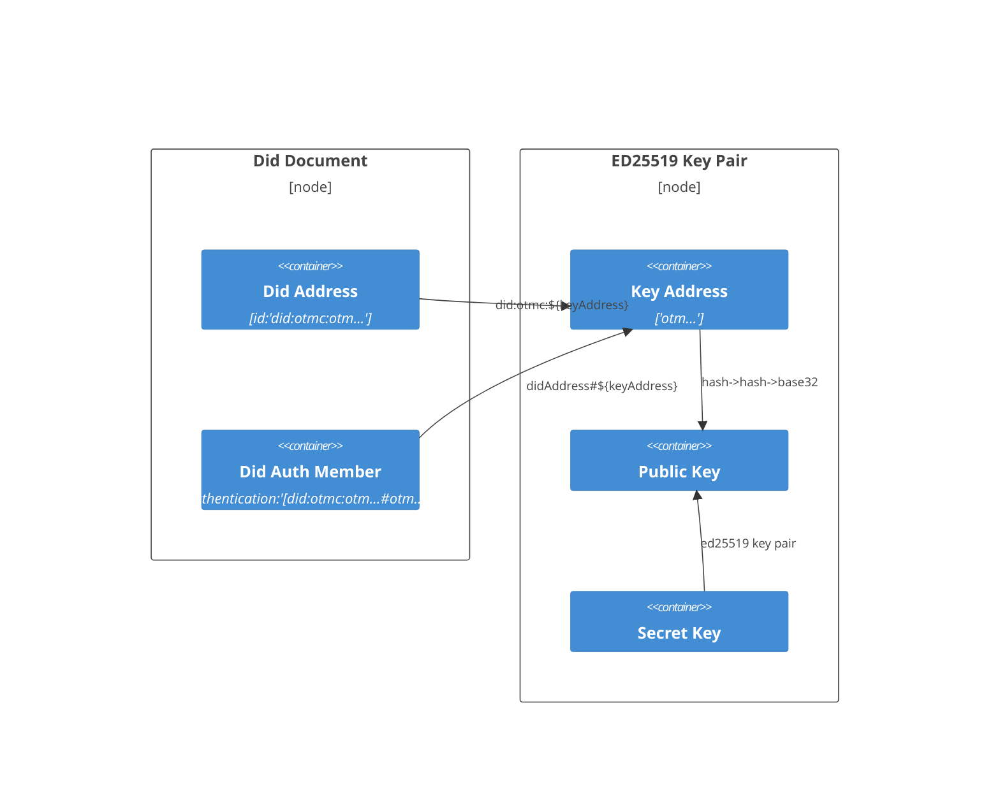

# otmc and did document
open transparent mqtt cluster

## DidDocument and EdAuth EdDsaKey:

```mermaid
C4Deployment
    Deployment_Node(did, "Did Document") {
        Container(didAddress, "Did Address","id:'did:otmc:otm...'")
        Container(didAuth, "Did Auth Member","authentication:'[did:otmc:otm...#otm...']'")
    }

    Deployment_Node(EdDsaKey, "ED25519 Key Pair") {
        Container(keyAddress, "Key Address","'otm...'")
        Container(publicKey, "Public Key",)
        Container(secretKey, "Secret Key",)
    }
    Rel(keyAddress, publicKey, "hash->hash->base32", "")
    Rel(secretKey, publicKey, "ed25519 key pair", "")


    Rel(didAddress, keyAddress, "did:otmc:${keyAddress}", "")

    Rel(didAuth, keyAddress, "didAddress#${keyAddress}", "")

```
